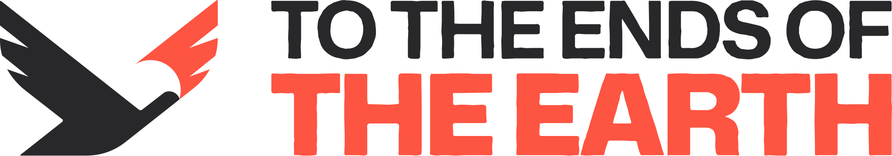

<picture>
  <source media="(prefers-color-scheme: dark)" srcset="assets/logos/complete/horizontal-white.svg">
  
</picture>

# Brand system

The brand system for **To The Ends of The Earth**, a global mission mobilization
movement and a sub-brand of Hope Channel International.

Everything here is derived from the official sources — the
[`lmtts/tte-brand-system`](https://github.com/lmtts/tte-brand-system) repository and the
designer's asset folder. No value was approximated: colors, typography, logos and specs
come from the source files.

## What is in this repository

| Path | What it is |
|---|---|
| `tte-brand-kit.html` | **The single file.** The whole brand in one self-contained page: 28 inline SVGs, the real fonts embedded, tokens copyable in four formats, components, organisms, voice and imagery. Opens offline, loads nothing from the network. |
| `design-system/` | The tree published to Claude Design, regenerable. Tokens, brand book, nine components with live previews, fonts. |
| `tokens/` | The four official formats (`css`, `json`, `scss`, `tailwind.js`) plus `tokens.compiled.css` generated from `tokens.json`. |
| `assets/logos/` | 26 optimized SVGs: mark, wordmark, lockup, Hope Channel co-brand. `source/` holds the designer's unoptimized exports. |
| `assets/patterns/` | The topographic texture, simple and tile. |
| `assets/fonts/` | Mona Sans variable, Space Mono regular and bold. |
| `brand-source/` | Reference material small enough to version: the imagery system documents, zoom backgrounds, social avatars and covers. |
| `build/` | The generator for the single file. |
| `scripts/check-contrast.mjs` | WCAG validator for the color pairs. |

Large binaries — the Figma file, the brand identity PDF, the photography library and the
social media output — live in Google Drive. See [ASSETS.md](ASSETS.md).

## Regenerate the single file

```bash
node build/build-kit.mjs
```

It reads `assets/` and `tokens/`, embeds everything and writes `tte-brand-kit.html`.

## Validate color contrast

```bash
node scripts/check-contrast.mjs
```

It reads the real values from `design-system/tokens.json` and separates an expected
failure from a regression. It exits non-zero only on a regression.

## Published design system

Claude Design, as a browsable reference:
<https://claude.ai/artifact/VxjLRFWebzhRw6SboqhYxQ> — private until shared from the
page's own Share menu.

## The open contrast point

White on Fire Orange measures **3.20:1**: it passes as large or bold text and fails as
normal text. That is exactly the brand's primary CTA, and it is an approved decision —
the Button spec upstream already records the follow-up and names the way out (a dark
label measures 4.64:1). The pair was **kept as it is**; this system documents where each
color is safe instead of correcting the brand on its own.

Grey `#949494` on white measures 3.03:1 — keep the grey on dark grounds only.

## Sources of truth

- Tokens and specs: [`lmtts/tte-brand-system`](https://github.com/lmtts/tte-brand-system)
- Figma: [To The Ends of The Earth](https://www.figma.com/design/QJpddccb8biAnsDiSKjcNf/To-The-Ends-of-The-Earth)
- Heavy assets: [ASSETS.md](ASSETS.md)
